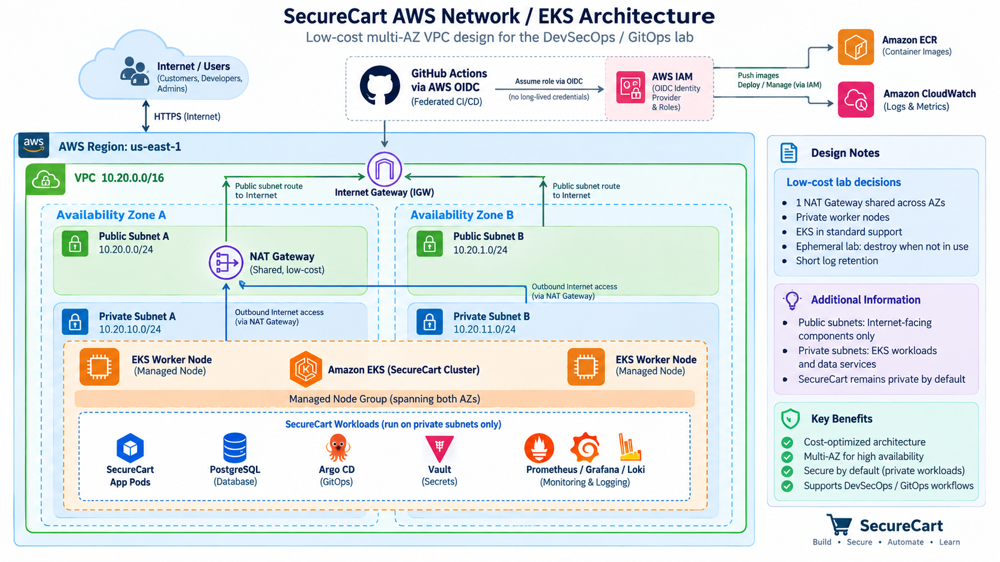

# SecureCart — End-to-End DevSecOps/GitOps Runbook

SecureCart is a small Java/Spring Boot REST application wrapped in a production-shaped, cost-conscious DevSecOps/GitOps delivery platform on AWS. This README is the **single procedural runbook** for the project. Follow it in order from Git/GitHub setup through Amazon EKS, security controls, GitOps, observability, rollback, and cleanup.

> **Primary cost rule:** the EKS environment is temporary. Create it only when you are ready to use it, and destroy it when you finish a lab session. Stop the Ubuntu engineering workstation whenever you are not using it.

## Runbook baseline and operating rules

This revision incorporates the implementation corrections made while building the lab on a clean Ubuntu 24.04 EC2 workstation. The validated baseline used by this runbook is:

- GitHub organization: `SecureCart-Lab` in the worked examples; replace it if you use another organization.
- Ubuntu engineering workstation: Ubuntu 24.04 LTS.
- Java: 21.
- Spring Boot: 4.1.1.
- Maven: system package installed on the EC2 workstation.
- Docker Engine: Docker's official Ubuntu repository with Docker Compose v2.
- Terraform: HashiCorp's official APT repository.
- Amazon EKS: Kubernetes 1.36 for this lab.
- kubectl: 1.36.2 to match the lab control-plane minor version.
- GitGuardian `ggshield` and Checkov: installed with `pipx`.
- GitHub authentication from EC2: SSH is preferred for interactive Git push/pull operations.
- GitHub Actions to AWS: OIDC temporary credentials; do not store long-lived AWS access keys in GitHub.

The project has **no Jira dependency**. Treat this README as the procedural source of truth and follow the phases in order. Commands labeled **[EC2]** are run in the VS Code Remote SSH terminal connected to the Ubuntu instance.

### Important line-ending rule

Linux shell scripts must use LF line endings. This repository includes `.gitattributes` to enforce LF for `*.sh` and other source files. If a shell script ever produces an error containing `$'\r'`, normalize it before running it:

```bash
sed -i 's/\r$//' scripts/*.sh
bash -n scripts/install-ubuntu-tools.sh
```

A successful `bash -n` produces no output.

---

## 0. What you will build

```text
Windows workstation
   |
   +--> GitHub: securecart-devsecops
   |        |
   |        +--> Pull-request CI
   |        |      +--> Maven / JUnit / JaCoCo
   |        |      +--> ggshield
   |        |      +--> OWASP Dependency-Check
   |        |      +--> SonarQube (on demand)
   |        |      +--> Terraform fmt / Checkov
   |        |
   |        +--> GitHub OIDC --> AWS IAM temporary credentials
   |        |                         |
   |        |                         +--> Terraform --> VPC / EKS / ECR / EBS CSI
   |        |
   |        +--> Release workflow
   |               +--> Docker build
   |               +--> Trivy gate
   |               +--> Syft/SPDX SBOM
   |               +--> ECR push
   |               +--> Cosign keyless signature
   |               +--> update securecart-gitops
   |
   +--> Terraform --> Ubuntu 24.04 engineering EC2
                         |
                         +--> VS Code Remote SSH
                         +--> local build/test/container work
                         |
                         +--> kubectl / Helm --> EKS
                                                   |
                                  securecart-gitops |
                                         |          |
                                         v          v
                                      Argo CD --> SecureCart
                                         |
              +--------------------------+---------------------------+
              |          |          |          |          |           |
           Kyverno     Vault      Falco    Prometheus    Loki      EBS CSI
                                              |           ^
                                           Grafana      Alloy
                                              |
                                         Alertmanager
                                              |
                                            Slack
```

---

### AWS network / EKS architecture



---

The SecureCart application contains Product and Order APIs, PostgreSQL persistence, Flyway migrations, Spring Security, JUnit tests, JaCoCo coverage, and Spring Boot Actuator/Prometheus metrics.

The project uses two repositories:

- `securecart-devsecops` — application source, tests, Docker, GitHub Actions, Terraform, security scripts, and this master runbook.
- `securecart-gitops` — Helm chart, Argo CD Applications, Kubernetes policies, storage, Vault, Falco, monitoring, and logging desired state.

---

## 0.1 Environments used in this README

Every procedure tells you where to run it.

| Label | Meaning |
| --- | --- |
| **[WINDOWS]** | Your local Windows machine, normally VS Code + Git Bash or PowerShell |
| **[GITHUB]** | GitHub website |
| **[AWS CONSOLE]** | AWS web console |
| **[EC2]** | Ubuntu 24.04 engineering workstation through VS Code Remote SSH |
| **[EKS]** | Commands run from EC2 against the EKS cluster with `kubectl`/`helm` |

Do not run an EC2 command on Windows or a Windows bootstrap command on EC2 unless the step explicitly says it is interchangeable.

---

## 0.2 Cost model and guardrails

The lab defaults to:

- AWS Region: `us-east-1`
- Kubernetes: EKS `1.36`
- EKS network: 2 availability zones, 2 public + 2 private subnets
- NAT Gateway: 1, deliberately shared across the two private subnets for the lab
- EKS worker: 1 `t3a.xlarge`, maximum 2
- Workstation: 1 `t3a.large`, 30 GiB encrypted gp3, T-family credit mode `standard`
- ECR: immutable tags + lifecycle keeping the newest 10 images
- EKS control-plane log retention: 7 days
- no paid Managed Prometheus/Grafana/OpenSearch
- no application ALB by default; use `kubectl port-forward`

As of September 2026, AWS lists standard-support EKS cluster pricing at **$0.10 per cluster-hour**. NAT Gateway and public IPv4 also incur hourly charges, in addition to EC2/EBS and data transfer. Verify current regional pricing before creating resources:

- EKS pricing: <https://aws.amazon.com/eks/pricing/>
- VPC/NAT/public IPv4 pricing: <https://aws.amazon.com/vpc/pricing/>
- AWS Pricing Calculator: <https://calculator.aws/>

### Cost rules for this project

1. Create an AWS Budget before compute.
2. Keep the workstation stopped when you are not using it.
3. Do not run EKS continuously for days just because the lab is unfinished.
4. Avoid `Service` type `LoadBalancer` unless you intentionally want its cost.
5. Use one NAT Gateway for the lab, not one per AZ.
6. Keep observability retention short.
7. Destroy the EKS lab after the exercise.
8. Check for orphaned EBS volumes, NAT Gateways, and load balancers after destroy.

---

## PHASE 1 — Prepare the Windows bootstrap workstation

---

The **first four phases happen on Windows** because the Ubuntu EC2 workstation does not exist yet.

## 1.1 Required local software

**[WINDOWS]** Install or verify:

- Git
- VS Code
- VS Code extension: **Remote - SSH**
- AWS CLI v2 (`2.32.0` or newer if you use `aws login`)
- Terraform `>= 1.8`
- OpenSSH client (included with modern Windows; Git Bash also includes SSH tooling)

Verify from Git Bash or PowerShell:

```bash
git --version
aws --version
terraform version
ssh -V
```

Do not install the full Linux engineering toolchain on Windows. Java, Maven, Docker, kubectl, Helm, ggshield, and Checkov will be installed on the Ubuntu EC2 workstation later.

## 1.2 Create the AWS budget before compute

**[AWS CONSOLE]** Open:

```text
Billing and Cost Management
  -> Budgets
  -> Create budget
  -> Cost budget
```

Choose a monthly amount that you are comfortable spending. Add email alerts such as 50%, 80%, and 100%.

Use these project tags wherever Terraform supports them:

```text
Project=SecureCart
Environment=lab
ManagedBy=Terraform
```

`A budget is an alert, not a hard spending cap.`

## 1.3 Verify your dedicated IAM user

This guide assumes you already have a **dedicated non-root IAM user** for the lab.

**[AWS CONSOLE]** Confirm:

```text
IAM -> Users -> <your-user>
```

Recommended:

- MFA enabled.
- Root user is not used for daily project work.
- The IAM user has the AWS permissions required for this personal lab.
- `SignInLocalDevelopmentAccess` is attached directly or through a group/role if you want to use browser-based `aws login` temporary credentials.

`If the IAM identity does not already have permissions that include signin:AuthorizeOAuth2Access and signin:CreateOAuth2Token, attach the AWS-managed SignInLocalDevelopmentAccess policy. An IAM user with the AWS-managed AdministratorAccess policy already has these permissions and does not require this additional policy.`

The project spans EC2, VPC, S3, IAM, EKS, ECR, CloudWatch, and related APIs.
In a personal learning account you may intentionally use a lab administrator identity.
In a company account, use organization-approved least privilege instead.

## 1.4 Authenticate the AWS CLI with temporary credentials

**[WINDOWS]** Verify your AWS CLI version:

```bash
aws --version
```

If it is at least 2.32.0, configure a named profile:

```bash
aws configure set region us-east-1 --profile securecart
aws configure set output json --profile securecart
aws login --profile securecart
```

Your browser opens. Sign in with your dedicated IAM user and complete MFA.

Verify:

```bash
aws sts get-caller-identity --profile securecart
```

Set the profile for the current terminal.

Git Bash:

```bash
export AWS_PROFILE=securecart
```

PowerShell:

```powershell
$env:AWS_PROFILE="securecart"
```

Then verify without specifying `--profile`:

```bash
aws sts get-caller-identity
```

Do not commit AWS access keys. Do not create GitHub `AWS_ACCESS_KEY_ID` or `AWS_SECRET_ACCESS_KEY` secrets for this project.

---

## PHASE 2 — Create GitHub repositories and import the supplied project

This runbook assumes you start with two empty GitHub repositories and the supplied project bundle extracted somewhere on Windows. After extracting the ZIP, rename its top-level folder to `securecart-source` so the commands below match exactly.

## 2.1 Recommended Windows layout

**[WINDOWS]** Create a workspace such as:

```text
SecureCart-Workspace/
├── securecart-source/            # extracted project bundle; NOT a Git repository
│   ├── securecart-devsecops/
│   └── securecart-gitops/
├── securecart-devsecops/         # real Git clone created below
└── securecart-gitops/            # real Git clone created below
```

Do not `git init` the `securecart-source` directory.

## 2.2 Create the two empty GitHub repositories

**[GITHUB]** Create:

```text
securecart-devsecops
securecart-gitops
```

For this learning lab they may be public. **Do not initialize** them with a `README`, `.gitignore`, `license`, or `template`.

## 2.3 Authenticate to the GitHub organization and clone the repositories

The repositories are owned by a GitHub organization. Your SSH key is added to **your personal GitHub account**; GitHub then uses your account's organization/repository permissions to decide whether you can push. If the organization enforces SSO, authorize the key for that organization when GitHub requests it.

**[WINDOWS]** If you already have GitHub SSH authentication configured, verify it:

```bash
ssh -T git@github.com
```

For the current lab organization, clone with SSH:

```bash
cd SecureCart-Workspace
git clone git@github.com:SecureCart-Lab/securecart-devsecops.git
git clone git@github.com:SecureCart-Lab/securecart-gitops.git
```

If you use another organization, replace `SecureCart-Lab`. HTTPS also works, but GitHub requires a personal access token rather than your account password for command-line Git authentication.

Configure Git identity if necessary:

```bash
git config --global user.name "Your Name"
git config --global user.email "YOUR_GITHUB_EMAIL"
```

Verify the DevSecOps remote:

```bash
cd securecart-devsecops
git remote -v
```

Expected organization remote:

```text
origin  git@github.com:SecureCart-Lab/securecart-devsecops.git (fetch)
origin  git@github.com:SecureCart-Lab/securecart-devsecops.git (push)
```

## 2.4 Create an empty `main` branch first

Do this in each clone so GitHub has a branch to protect.

**[WINDOWS]** DevSecOps repository:

```bash
cd securecart-devsecops
git switch -c main
git commit --allow-empty -m "Initialize SecureCart DevSecOps repository"
git push -u origin main
```

GitOps repository:

```bash
cd ../securecart-gitops
git switch -c main
git commit --allow-empty -m "Initialize SecureCart GitOps repository"
git push -u origin main
```

## 2.5 Protect `main`

**[GITHUB]** For both repositories:

```text
Repository -> Settings -> Rulesets -> New ruleset -> New branch ruleset
```

Create an active ruleset targeting `main` and enable at minimum:

- Name: Protect main
- Enforcement status: Active
- Require a pull request before merging;
- Block force pushes;
- Restrict deletion.

Do not require CI status checks yet because the checks have not run yet.

## 2.6 Import the complete supplied project through a bootstrap PR

**[WINDOWS]** DevSecOps:

```bash
cd SecureCart-Workspace/securecart-devsecops
git switch main
git pull --ff-only origin main
git switch -c bootstrap/project-baseline
cp -a ../securecart-source/securecart-devsecops/. .
git status --short
git add -A
git diff --cached --stat
git commit -m "Bootstrap SecureCart DevSecOps project"
git push -u origin bootstrap/project-baseline
```

**[GITHUB]** Open a PR from `bootstrap/project-baseline` to `main`, review the file list, and merge it.

Then clean up locally:

```bash
git switch main
git pull --ff-only origin main
git branch -d bootstrap/project-baseline
```

Repeat for GitOps:

```bash
cd ../securecart-gitops
git switch main
git pull --ff-only origin main
git switch -c bootstrap/project-baseline
cp -a ../securecart-source/securecart-gitops/. .
git status --short
git add -A
git diff --cached --stat
git commit -m "Bootstrap SecureCart GitOps project"
git push -u origin bootstrap/project-baseline
```

Open, review, and merge the PR, then:

```bash
git switch main
git pull --ff-only origin main
git branch -d bootstrap/project-baseline
```

From now on use descriptive branches such as:

```text
feature/github-actions-ci
feature/eks-infrastructure
feature/vault-integration
fix/network-policy
chore/dependency-updates
```

---

# PHASE 3 — Provision the Ubuntu 24.04 engineering workstation with Terraform

The workstation Terraform is intentionally part of `securecart-devsecops` so the engineering environment is reproducible.

## 3.1 Create or identify an EC2 key pair

**[AWS CONSOLE]** Open:

```text
EC2 -> Network & Security -> Key Pairs
```

Create/select an RSA `.pem` key pair. Save the private key securely on Windows, for example:

```text
C:\Users\YOUR_NAME\.ssh\securecart-workstation.pem
```

Terraform needs the **AWS key-pair name**, not the local file path.

## 3.2 Determine your public IPv4 address

**[WINDOWS]**:

```bash
curl -s https://checkip.amazonaws.com
```

If the result is `203.0.113.10`, use:

```text
203.0.113.10/32
```

Never use `0.0.0.0/0` for SSH in this lab.

## 3.3 Configure workstation variables

**[WINDOWS]**:

```bash
cd SecureCart-Workspace/securecart-devsecops/infrastructure/terraform/workstation
cp terraform.tfvars.example terraform.tfvars
```

Edit `terraform.tfvars`:

```hcl
key_name = "YOUR_EXISTING_KEY_PAIR_NAME"
ssh_cidr = "YOUR_PUBLIC_IP/32"
```

Verify it is ignored by Git:

```bash
git check-ignore -v terraform.tfvars
```

## 3.4 Plan and create the workstation

**[WINDOWS]**:

```bash
terraform fmt -recursive
terraform init
terraform validate
terraform plan -out=tfplan
```

Review the plan. It should create a small dedicated workstation VPC, public subnet, internet gateway, route table, SSH security group, and one Ubuntu 24.04 EC2 instance.

Apply only after you are satisfied:

```bash
terraform apply tfplan
terraform output
```

Record:

```bash
terraform output -raw instance_id
terraform output -raw public_ip
```

## 3.5 Verify in AWS

**[AWS CONSOLE]** Confirm:

- instance name `securecart-workstation`;
- Ubuntu 24.04;
- `t3a.large` by default;
- 30 GiB encrypted gp3;
- IMDSv2 required;
- SSH security-group source is exactly your `/32`;
- the instance has a public IPv4 address.

## 3.6 Test plain SSH before VS Code

**[WINDOWS]** Git Bash example:

```bash
ssh -i ~/.ssh/securecart-workstation.pem ubuntu@$(terraform output -raw public_ip)
```

On the server:

```bash
whoami
hostname
cat /etc/os-release
```

Expected user: `ubuntu`; OS: Ubuntu 24.04.

Exit:

```bash
exit
```

## 3.7 Configure VS Code Remote SSH

**[WINDOWS]** Add to `C:\Users\YOUR_NAME\.ssh\config`:

```text
Host securecart-workstation
    HostName <EC2_PUBLIC_IP>
    User ubuntu
    IdentityFile C:/Users/YOUR_NAME/.ssh/securecart-workstation.pem
    IdentitiesOnly yes
```

Test:

```bash
ssh securecart-workstation
```

Then in VS Code:

```text
Ctrl+Shift+P
  -> Remote-SSH: Connect to Host
  -> securecart-workstation
```

Open a terminal in the new Remote SSH window and verify:

```bash
whoami
hostname
pwd
```

Expected:

```text
ubuntu
ip-...
/home/ubuntu
```

> From this point onward, most engineering commands run on **EC2**, not Windows.

## 3.8 Stop/start the workstation to save money

When you finish working, you may stop rather than destroy it.

**[WINDOWS]** from the workstation Terraform directory:

```bash
aws ec2 stop-instances \
  --instance-ids "$(terraform output -raw instance_id)" \
  --region us-east-1
```

Start later:

```bash
aws ec2 start-instances \
  --instance-ids "$(terraform output -raw instance_id)" \
  --region us-east-1

aws ec2 wait instance-running \
  --instance-ids "$(terraform output -raw instance_id)" \
  --region us-east-1

terraform apply -refresh-only -auto-approve
terraform output -raw public_ip
```

A stopped/started instance can receive a new public IP. Update the `HostName` in your SSH config when that happens.

---

# PHASE 4 — Prepare the EC2 engineering environment

## 4.1 Bootstrap Git only

Git is needed to clone the repository that contains the installation script.

**[EC2]**:

```bash
sudo apt-get update
sudo apt-get install -y git
```

## 4.2 Configure Git identity on EC2

**[EC2]**:

```bash
git config --global user.name "Your Name"
git config --global user.email "YOUR_GITHUB_EMAIL"
git config --global --list
```

## 4.3 Configure GitHub SSH authentication from EC2

Use SSH for interactive Git operations from the EC2 engineering workstation. This avoids repeatedly entering an HTTPS username/token.

**[EC2]** Generate a key:

```bash
ssh-keygen -t ed25519 -C "securecart-workstation"
```

Press Enter to accept the default path `~/.ssh/id_ed25519`. Use a passphrase if desired. Display only the **public** key:

```bash
cat ~/.ssh/id_ed25519.pub
```

**[GITHUB]** Add the public key to your personal GitHub account:

```text
Profile picture
  -> Settings
  -> SSH and GPG keys
  -> New SSH key
```

Suggested title:

```text
SecureCart EC2 Workstation
```

Then test from EC2:

```bash
ssh -T git@github.com
```

On first connection, verify/accept GitHub's host key prompt. A successful test identifies your GitHub account.

> The key belongs to your personal GitHub identity even though the repositories are under `SecureCart-Lab`. Your organization membership and repository permissions grant access.

## 4.4 Clone both repositories onto EC2

**[EC2]**:

```bash
mkdir -p ~/projects
cd ~/projects

git clone git@github.com:SecureCart-Lab/securecart-devsecops.git
git clone git@github.com:SecureCart-Lab/securecart-gitops.git
```

Verify:

```bash
cd ~/projects/securecart-devsecops
git status
git remote -v
```

## 4.5 Install the engineering toolchain on a clean EC2 instance

The supplied installer is a **first-run bootstrap** for a brand-new Ubuntu 24.04 LTS instance. It installs the base engineering packages, Docker Engine/Compose, AWS CLI v2, Terraform, kubectl, Helm, `ggshield`, and Checkov. It also configures `~/.local/bin` for `pipx` applications and adds the `ubuntu` user to the `docker` group.

**[EC2]**:

```bash
cd ~/projects/securecart-devsecops

# Syntax check only; no installation occurs.
bash -n scripts/install-ubuntu-tools.sh

# Make all project shell scripts executable.
chmod +x scripts/*.sh

# Run the first-time workstation bootstrap.
./scripts/install-ubuntu-tools.sh
```

The installer uses `sudo` internally. **Do not** run the whole script with `sudo`.

The script installs:

- Git and common Linux utilities;
- Java 21 and Maven;
- Docker Engine, Buildx, and Docker Compose v2 from Docker's official repository;
- AWS CLI v2;
- Terraform from HashiCorp's repository;
- kubectl 1.36.2;
- Helm 3;
- `pipx`;
- GitGuardian `ggshield`;
- Checkov;
- `jq`, `rsync`, `curl`, `wget`, `unzip`, and related utilities.

### Docker group activation is a login-session change

The installer runs:

```bash
sudo usermod -aG docker "$USER"
```

and verifies that the account is recorded in the Docker group. However, the **current SSH/VS Code process keeps the old group list**. Therefore, when the script completes, fully disconnect the VS Code Remote SSH connection and reconnect to the EC2 instance. Opening only another terminal inside the same remote VS Code session may still reuse the old login context.

After reconnecting, verify:

```bash
id
getent group docker
docker ps

git --version
java -version
javac -version
mvn -version
docker --version
docker compose version
terraform version
aws --version
kubectl version --client
helm version --short
ggshield --version
checkov --version
rsync --version | head -n 1
```

Expected Docker conditions:

- `id` includes the `docker` group;
- `getent group docker` lists `ubuntu`;
- `docker ps` works **without** `sudo`.

Expected `pipx` command locations:

```bash
command -v ggshield
command -v checkov
```

Expected paths:

```text
/home/ubuntu/.local/bin/ggshield
/home/ubuntu/.local/bin/checkov
```

If those tools are installed by `pipx` but not found, verify that `$HOME/.local/bin` appears in `echo "$PATH"`. The installer writes the PATH entry to both `~/.profile` and `~/.bashrc`.

### What the installer cleanup block does

The `cleanup()` function and `trap cleanup EXIT` remove only temporary download files under `/tmp` when the installer exits. They do **not** uninstall AWS CLI, kubectl, Helm, or other installed tools.

## 4.6 Authenticate AWS CLI from the remote EC2 workstation

The EC2 terminal normally has no local browser, so use remote browser authentication.

**[EC2]**:

```bash
aws configure set region us-east-1 --profile securecart
aws configure set output json --profile securecart
aws login --remote --profile securecart
```

The command gives you a URL/code. Open it in your Windows browser and sign in with the same dedicated IAM user.

Then:

```bash
export AWS_PROFILE=securecart
aws sts get-caller-identity
```

Temporary local-development credentials are preferable to copying long-lived IAM access keys onto the workstation.

## 4.7 Normal Git workflow: EC2 -> GitHub organization -> local Windows

Use `main` as the protected integration branch. Make implementation changes on a feature branch, push the branch from EC2, merge through a pull request, then synchronize `main` back to your Windows clone.

### A. Start new work from current `main` on EC2

**[EC2]**:

```bash
cd ~/projects/securecart-devsecops
git switch main
git pull --ff-only origin main
git switch -c feature/<short-description>
```

Example:

```bash
git switch -c feature/gitguardian-integration
```

### B. Review, stage, commit, and push

```bash
git status
git diff

git add -A
git status
git diff --cached --stat

git commit -m "Describe the change"
git push -u origin feature/<short-description>
```

`git add -A` stages new, modified, and deleted files throughout the repository. Always inspect `git status` first so credentials, `.env` files, Terraform state, keys, or other secrets are not accidentally staged.

If Git prompts for `Username for 'https://github.com'`, the remote is using HTTPS. For this EC2 workstation, switch it to SSH:

```bash
git remote set-url origin git@github.com:SecureCart-Lab/securecart-devsecops.git
git remote -v
```

Then retry the push.

### C. Merge through GitHub

**[GITHUB]** create a pull request:

```text
feature/<short-description> -> main
```

Review the diff and CI checks. Merge only after the required checks pass.

### D. Update EC2 after the PR is merged

```bash
git switch main
git pull --ff-only origin main
git log -1 --oneline
```

If the feature branch is no longer needed:

```bash
git branch -d feature/<short-description>
```

Optionally delete it from GitHub:

```bash
git push origin --delete feature/<short-description>
git fetch --prune origin
```

### E. Pull the same merged code to your local Windows clone

**[WINDOWS]**:

```bash
cd SecureCart-Workspace/securecart-devsecops
git fetch origin
git switch main
git pull --ff-only origin main
git log -1 --oneline
```

If `HEAD -> main` and `origin/main` are on the same commit, your local working copy contains the same merged code that originated on EC2 and was merged in GitHub.

If you intentionally want the remote feature branch rather than the merged `main`, first fetch it. If the branch already exists locally:

```bash
git switch feature/<short-description>
git pull --ff-only
```

If it does not exist locally:

```bash
git switch --track origin/feature/<short-description>
```

`Already up to date.` means the current local branch already contains every commit available from its configured upstream branch. It does **not** mean no one recently pushed; it means there is nothing additional for that branch to download.

---

---

# PHASE 5 — Build, test, and run SecureCart locally

## 5.1 Understand the core files

```text
pom.xml                                  Maven build / JaCoCo / Dependency-Check
src/main/java/com/securecart/            application source
src/main/resources/application.yml       runtime configuration
src/main/resources/db/migration/         Flyway SQL migrations
src/test/                                JUnit tests
docker-compose.yml                       local app + PostgreSQL
Dockerfile                               multi-stage application image
```

## 5.2 Run unit/integration tests and coverage

**[EC2]**:

```bash
cd ~/projects/securecart-devsecops
mvn clean verify -Ddependency-check.skip=true
```

In one sentence, this command **deletes the previous Maven build output, compiles the application, runs the test/verification lifecycle, enforces JaCoCo coverage, and skips OWASP Dependency-Check for this fast application-build validation**.

Expected:

- `BUILD SUCCESS`;
- JUnit tests pass;
- JaCoCo enforcement passes;
- HTML report exists at `target/site/jacoco/index.html`.

The starter line-coverage gate is 40% so the educational baseline can pass. Increase it as the application evolves.

Verify the report:

```bash
ls -lh target/site/jacoco/index.html
```

### Spring Boot 4 test dependency correction

This project uses Spring Boot 4.1.1. The `pom.xml` therefore uses the Boot 4 modular starters, including:

```text
spring-boot-starter-webmvc
spring-boot-starter-webmvc-test
spring-boot-starter-security-test
spring-boot-starter-data-jpa-test
spring-boot-starter-flyway
```

`ProductControllerTest` correctly imports:

```java
import org.springframework.boot.webmvc.test.autoconfigure.WebMvcTest;
```

Do not replace it with the older Spring Boot 3 package.

## 5.3 Run the local Docker stack and smoke test it

Docker Compose is used because the local application depends on more than one container: SecureCart plus PostgreSQL. Compose defines their images/build, environment variables, networking, volume, startup dependency, and ports in one reproducible `docker-compose.yml`. The simpler alternative would be multiple manual `docker run` commands; Kubernetes/Helm are used later for EKS rather than for this basic local-development stack.

Before starting, confirm normal-user Docker access:

```bash
id
docker ps
```

**[EC2]** start the local stack:

```bash
cd ~/projects/securecart-devsecops
docker compose up --build -d
```

In one sentence: `docker compose up --build -d` **builds/rebuilds the required images, creates and starts the Compose services, and runs them in the background**.

Inspect status:

```bash
docker compose ps
```

If a service is unhealthy or exits, inspect logs:

```bash
docker compose logs --tail=200
docker compose logs -f app
```

### Smoke test

A smoke test is a fast post-start/deployment check that answers: **is the application alive and are a few critical paths reachable?** It does not replace unit, integration, security, or end-to-end testing.

Run the supplied test:

```bash
./scripts/smoke-test.sh
```

The script waits for startup, requires `/actuator/health` to report `UP`, and confirms `/api/products` returns a non-empty JSON array.

Manual equivalents:

```bash
curl http://localhost:8080/actuator/health
curl http://localhost:8080/api/products
```

Expected health response:

```json
{"status":"UP"}
```

Expected products response: a JSON array containing the seeded demo products. Exact IDs/format may vary, but it should resemble:

```json
[
  {
    "id": 1,
    "sku": "SEC-KEY-001",
    "name": "Security Key"
  }
]
```

Create a local demo order with Basic Authentication:

```bash
curl -i -u student:student-local-only \
  -H 'Content-Type: application/json' \
  -d '{"customerEmail":"student@example.com","items":[{"productId":1,"quantity":1}]}' \
  http://localhost:8080/api/orders
```

The command authenticates as the local `student` user and sends a JSON `POST` request to create an order for one unit of product ID 1. Expect an HTTP 2xx response and an order JSON body according to the controller implementation.

> The values `student-local-only`, `admin-local-only`, and `local-dev-password` are deliberately local-lab credentials from the Compose configuration. Do not reuse them for EKS/production credentials.

## 5.4 Verify Flyway

**[EC2]**:

```bash
docker compose exec postgres psql -U securecart -d securecart \
  -c 'select installed_rank, version, description, success from flyway_schema_history order by installed_rank;'
```

Expected: `V1` and `V2` each appear once and are successful.

Stop the stack:

```bash
docker compose down
```

---

# PHASE 6 — Local and CI security controls

## 6.1 GitGuardian / ggshield

GitGuardian `ggshield` scans the repository for accidentally exposed secrets such as API keys, tokens, passwords, private keys, and cloud credentials. Use it locally before pushing and automatically in CI.

### 6.1.1 Verify `ggshield` on EC2

```bash
cd ~/projects/securecart-devsecops
ggshield --version
command -v ggshield
```

Expected executable path:

```text
/home/ubuntu/.local/bin/ggshield
```

### 6.1.2 Create a GitGuardian token

**[BROWSER / GITGUARDIAN]**:

1. Create/sign in to a GitGuardian free-plan workspace.
2. Open the API/personal-access-token settings.
3. Create a token with at least the `scan` capability.
4. Give it a descriptive name such as `securecart-dev-workstation`.
5. Choose an appropriate expiration period for the lab.
6. Copy the token when shown.

Never put this token in `README.md`, application configuration, a committed `.env`, a script, or Git history.

### 6.1.3 Load the token into the current EC2 shell without echoing it

Instead of typing the actual token into a visible `export ...='<token>'` command, use:

```bash
read -s -p "Enter GitGuardian API token: " GITGUARDIAN_API_KEY
echo
export GITGUARDIAN_API_KEY
```

Verify only that the variable exists:

```bash
if [[ -n "${GITGUARDIAN_API_KEY:-}" ]]; then
  echo "GitGuardian API key is loaded."
else
  echo "GitGuardian API key is NOT loaded."
fi
```

Do not print the token with `echo "$GITGUARDIAN_API_KEY"`.

### 6.1.4 Run the local repository scan

```bash
cd ~/projects/securecart-devsecops
ggshield secret scan repo .
```

The `.` means the Git repository in the current directory. A clean scan should exit successfully. Immediately after the scan, you can inspect the exit status:

```bash
echo $?
```

Expected for a clean scan:

```text
0
```

If a real credential is detected, revoke/rotate it first, remove it from source, and clean Git history if it was committed. Do not simply suppress a real exposed credential.

When finished with the local token:

```bash
unset GITGUARDIAN_API_KEY
```

### 6.1.5 Store the token for GitHub Actions

The EC2 environment variable is not visible to GitHub-hosted runners. **[GITHUB]** in `securecart-devsecops` open:

```text
Settings
  -> Secrets and variables
  -> Actions
  -> Secrets
  -> New repository secret
```

Name the repository secret exactly:

```text
GITGUARDIAN_API_KEY
```

Paste the token value and save it. GitHub will retain the secret value but will not show it back in plaintext.

The supplied `ci.yml` maps the secret into the job environment and runs:

```bash
ggshield secret scan repo .
```

The job intentionally fails if `GITGUARDIAN_API_KEY` is missing and also fails when the scanner reports a secret. Never commit a real credential merely to test the scanner.

## 6.2 OWASP Dependency-Check

An NVD API key is optional but can improve update reliability/rate limits.

**[GITHUB]** optional secret:

```text
NVD_API_KEY
```

**[EC2]** local scan:

```bash
mvn org.owasp:dependency-check-maven:check
```

If using an NVD key:

```bash
mvn org.owasp:dependency-check-maven:check -DnvdApiKey="$NVD_API_KEY"
```

The build threshold is CVSS 7+. Fix or explicitly justify a specific suppression; do not disable the scanner globally just to obtain a green build.

## 6.3 SonarQube Community Build

The project pins a Community Build Docker image in `docker-compose.tools.yml`.

**[EC2]**:

```bash
docker compose -f docker-compose.tools.yml up -d
docker compose -f docker-compose.tools.yml ps
```

Keep port 9000 private. Use VS Code's forwarded ports or SSH forwarding to access `http://localhost:9000` from Windows.

On first login:

1. change the default password;
2. create project key `securecart`;
3. create a Sonar token.

**[GITHUB]** create:

```text
Secret:   SONAR_TOKEN
Variable: SONAR_HOST_URL=http://localhost:9000
```

## 6.4 Register EC2 as an on-demand self-hosted GitHub runner

**[GITHUB]**:

```text
securecart-devsecops
  -> Settings
  -> Actions
  -> Runners
  -> New self-hosted runner
```

Select Linux x64 and follow the exact commands GitHub provides; the registration token is temporary.

Add runner label:

```text
securecart
```

The supplied SonarQube workflow runs on `[self-hosted, linux, securecart]` and is manual/on-demand so your normal PRs do not depend on a workstation that you intentionally stop.

---

# PHASE 7 — GitHub Actions CI and branch protection

The supplied workflows are:

```text
.github/workflows/ci.yml             Maven / JUnit / JaCoCo / ggshield / Dependency-Check
.github/workflows/sonarqube.yml      on-demand SonarQube on EC2 runner
.github/workflows/iac.yml            Terraform fmt + Checkov
.github/workflows/terraform-lab.yml  OIDC-based plan/apply/destroy
.github/workflows/release.yml        build / scan / SBOM / ECR / sign / GitOps update
```

## 7.1 Exercise CI with a normal PR

**[EC2]**:

```bash
cd ~/projects/securecart-devsecops
git switch main
git pull --ff-only origin main
git switch -c test/verify-ci
```

Make a harmless documentation-only edit, commit it, and push:

```bash
git add README.md
git commit -m "Test GitHub Actions CI"
git push -u origin test/verify-ci
```

**[GITHUB]** open a PR. Confirm the CI workflow runs.

If CI is green, you may close the test PR without merging, or merge a legitimate documentation improvement.

## 7.2 Require stable CI checks

Only after successful checks exist, edit the `main` ruleset and require the exact stable check names shown by GitHub, normally the build/test, secret-scan, and dependency-scan jobs.

Do not require the on-demand SonarQube job for every PR because the EC2 runner may be stopped.

## 7.3 Optional Slack notifications

Create a Slack incoming webhook only if you want notifications.

**[GITHUB]** optional repository secret:

```text
SLACK_WEBHOOK_URL
```

The workflows safely skip Slack when the secret is absent.

---

# PHASE 8 — Terraform bootstrap: remote state and GitHub-to-AWS OIDC

This layer is run once from EC2 with your temporary AWS CLI identity because the GitHub OIDC role does not exist yet.

## 8.1 Verify AWS identity

**[EC2]**:

```bash
export AWS_PROFILE=securecart
aws sts get-caller-identity
```

If the login session expired:

```bash
aws login --remote --profile securecart
```

## 8.2 Configure bootstrap variables

**[EC2]**:

```bash
cd ~/projects/securecart-devsecops/infrastructure/terraform/bootstrap
cp terraform.tfvars.example terraform.tfvars
```

Edit:

```hcl
github_owner = "YOUR_GITHUB_OWNER"
```

`terraform.tfvars` is ignored by Git.

## 8.3 Apply the bootstrap

**[EC2]**:

```bash
terraform fmt -recursive
terraform init
terraform validate
terraform plan -out=tfplan
terraform apply tfplan
terraform output
```

Record:

```text
state_bucket
terraform_role_arn
```

This creates:

- encrypted/versioned S3 Terraform state bucket;
- GitHub Actions OIDC provider;
- repository/environment-scoped Terraform provisioning role.

The role uses `AdministratorAccess` as a deliberate **personal single-account learning-lab compromise**. In a real organization replace it with reviewed least-privilege provisioning permissions and a permission boundary.

## 8.4 Create the GitHub `lab` environment

**[GITHUB]**:

```text
securecart-devsecops
  -> Settings
  -> Environments
  -> New environment
  -> lab
```

Create these repository/environment variables:

```text
AWS_REGION=us-east-1
TF_STATE_BUCKET=<state_bucket output>
AWS_TERRAFORM_ROLE_ARN=<terraform_role_arn output>
```

Get the stable ARN of your dedicated IAM user. For an IAM user:

```bash
aws iam get-user --query 'User.Arn' --output text
```

Do not use an STS session ARN here. Create:

```text
ADMIN_PRINCIPAL_ARN=<stable IAM user/role ARN>
```

Get the EC2 workstation's current public IP from Windows Terraform output or from EC2:

```bash
curl -s https://checkip.amazonaws.com
```

Set:

```text
EKS_PUBLIC_ACCESS_CIDRS=["YOUR_WORKSTATION_PUBLIC_IP/32"]
```

If the workstation public IP changes later, update this variable and re-apply the lab Terraform before attempting `kubectl` access.

---

# PHASE 9 — Validate IaC before creating paid EKS resources

## 9.1 Local Terraform and Checkov gate

**[EC2]**:

```bash
cd ~/projects/securecart-devsecops/infrastructure/terraform/environments/lab
terraform init -backend=false
terraform fmt -check -recursive ../../
terraform validate
checkov -d ../../
```

Checkov remains blocking. The repository contains only a few inline suppressions for explicit lab cost decisions such as AWS-managed encryption and the temporary admin provisioning role. Treat suppressions as documented risk acceptance, not as a shortcut.

## 9.2 Verify Kubernetes version is still available

The supplied configuration defaults to EKS Kubernetes `1.36`, which is in standard support as of September 2026.

**[EC2]**:

```bash
aws eks describe-cluster-versions \
  --region us-east-1 \
  --query 'clusterVersions[].clusterVersion' \
  --output table
```

If `1.36` is no longer offered when you run the project in the future, deliberately update the Terraform variable and kubectl version after reviewing Kubernetes/EKS release notes.

---

# PHASE 10 — Create EKS, ECR, EBS CSI, and AWS networking

> **COST GATE:** this is where the largest hourly AWS charges begin. Do not run `apply` until you are ready to continue with the Kubernetes PHASEs.

## 10.1 Review what Terraform will create

The lab configuration creates:

```text
VPC 10.20.0.0/16
2 public subnets
2 private subnets
1 NAT Gateway
EKS 1.36 control plane
1 t3a.xlarge managed node (max 2)
ECR repository securecart
ECR lifecycle policy
GitHub OIDC release role
EBS CSI add-on + EKS Pod Identity
EKS control-plane logs with 7-day retention
```

## 10.2 Run Terraform plan through GitHub Actions

**[GITHUB]**:

```text
securecart-devsecops
  -> Actions
  -> Terraform Lab
  -> Run workflow
  -> action: plan
```

Review the log. Do not apply a plan you do not understand.

## 10.3 Apply the lab

**[GITHUB]**:

```text
Actions -> Terraform Lab -> Run workflow -> action: apply
```

EKS creation can take several minutes.

## 10.4 Configure kubectl

**[EC2]**:

```bash
aws eks update-kubeconfig --region us-east-1 --name securecart-lab
kubectl get nodes -o wide
kubectl get pods -A
```

Expected: one managed worker node is `Ready`.

## 10.5 Record ECR/release outputs

From the lab Terraform state you need:

```text
ecr_repository_url
release_role_arn
```

If needed from EC2:

```bash
cd ~/projects/securecart-devsecops/infrastructure/terraform/environments/lab
terraform init -backend-config="bucket=$TF_STATE_BUCKET"
terraform output
```

**[GITHUB]** create variables:

```text
AWS_RELEASE_ROLE_ARN=<release_role_arn>
ECR_REPOSITORY=securecart
```

---

# PHASE 11 — Prepare the GitOps repository

## 11.1 Replace GitHub owner placeholders

**[EC2]**:

```bash
cd ~/projects/securecart-gitops
git switch main
git pull --ff-only origin main
grep -R "REPLACE_ME" -n .
```

Create a branch:

```bash
git switch -c feature/configure-gitops-owner
```

Replace every GitHub URL placeholder:

```text
https://github.com/REPLACE_ME/securecart-gitops.git
```

with:

```text
https://github.com/YOUR_GITHUB_OWNER/securecart-gitops.git
```

The initial ECR image placeholder in `charts/securecart/values-lab.yaml` can remain until the release workflow updates it, or you can replace the account/repository with the Terraform ECR URL while keeping tag `bootstrap`.

Commit and merge through a PR:

```bash
git add argocd charts
git commit -m "Configure GitOps repository owner"
git push -u origin feature/configure-gitops-owner
```

After merge:

```bash
git switch main
git pull --ff-only origin main
```

## 11.2 Validate the Helm chart

**[EC2]**:

```bash
helm lint charts/securecart -f charts/securecart/values-lab.yaml
helm template securecart charts/securecart \
  -f charts/securecart/values-lab.yaml \
  > /tmp/securecart-rendered.yaml
```

Fix chart errors in Git rather than applying ad-hoc fixes directly to EKS.

---

# PHASE 12 — Install Argo CD privately

Argo CD is self-hosted in your cluster; do not enable Amazon EKS managed Argo CD capability for this lab because that is a separate paid capability and is not needed here.

## 12.1 Install Argo CD

**[EKS]** from EC2:

```bash
helm repo add argo https://argoproj.github.io/argo-helm
helm repo update
kubectl create namespace argocd --dry-run=client -o yaml | kubectl apply -f -

helm upgrade --install argocd argo/argo-cd \
  --namespace argocd \
  --version 10.9.0

kubectl -n argocd rollout status deployment/argocd-server --timeout=5m
```

## 12.2 Access Argo CD without a public load balancer

**[EC2]**:

```bash
kubectl -n argocd port-forward svc/argocd-server 8081:443
```

Forward port 8081 through VS Code/SSH and browse from Windows:

```text
https://localhost:8081
```

You do not need to expose Argo CD with `Service type=LoadBalancer` for this lab.

---

# PHASE 13 — Create runtime bootstrap secrets out-of-band

Do not commit database passwords, application passwords, Slack webhooks, Vault root tokens, or Vault unseal keys.

## 13.1 Generate local lab passwords

**[EC2]**:

```bash
cd ~/projects/securecart-devsecops

export DB_PASSWORD="$(openssl rand -base64 36)"
export APP_USER_PASSWORD="$(openssl rand -base64 36)"
export APP_ADMIN_PASSWORD="$(openssl rand -base64 36)"
```

Optional Slack:

```bash
export SLACK_WEBHOOK_URL='<your incoming webhook>'
```

## 13.2 Create Kubernetes Secrets

**[EC2/EKS]**:

```bash
./scripts/create-runtime-secrets.sh
```

This creates bootstrap secrets for SecureCart/PostgreSQL and optional Slack secrets for monitoring/Falco.

Verify metadata only:

```bash
kubectl get secret -n securecart
kubectl get secret -n monitoring 2>/dev/null || true
kubectl get secret -n falco 2>/dev/null || true
```

Do not run commands that print secret values into terminals you intend to screenshot or share.

---

# PHASE 14 — Bootstrap platform components through Argo CD

CRD-producing applications must exist before custom resources that use their CRDs.

**[EC2]**:

```bash
cd ~/projects/securecart-gitops
```

Apply foundation applications:

```bash
kubectl apply -f argocd/applications/storage.yaml
kubectl apply -f argocd/applications/kyverno.yaml
kubectl apply -f argocd/applications/vault.yaml
kubectl apply -f argocd/applications/monitoring.yaml
kubectl apply -f argocd/applications/loki.yaml
kubectl apply -f argocd/applications/alloy.yaml
kubectl apply -f argocd/applications/falco.yaml
```

Watch:

```bash
kubectl get applications -n argocd
kubectl get pods -A
```

After Kyverno and Prometheus CRDs exist:

```bash
kubectl apply -f argocd/applications/kyverno-policies.yaml
kubectl apply -f argocd/applications/monitoring-config.yaml
```

Pinned chart versions in the supplied GitOps repository are:

```text
Kyverno                3.8.2
Vault                   0.34.0
kube-prometheus-stack   89.2.0
Loki                    7.3.0
Alloy                   1.11.0
Falco                   9.1.0
```

Verify:

```bash
kubectl get storageclass gp3
kubectl get pods -n kyverno
kubectl get pods -n vault
kubectl get pods -n monitoring
kubectl get pods -n logging
kubectl get pods -n falco
```

A single `t3a.xlarge` is intentionally a compact lab worker. If pods remain Pending because of CPU/memory pressure, inspect requests/limits before increasing node size; if you temporarily increase capacity, remember the cost.

---

# PHASE 15 — Configure and run the container release supply chain

## 15.1 Create a GitOps write credential

The release workflow writes a new image tag into a **different GitHub repository**.

Create a fine-grained GitHub Personal Access Token restricted to `securecart-gitops` with:

```text
Contents: Read and write
```

**[GITHUB]** store it in `securecart-devsecops` as:

```text
GITOPS_PAT
```

AWS authentication still uses OIDC; the PAT is only for cross-repository Git write access.

## 15.2 Run the release workflow

**[GITHUB]**:

```text
securecart-devsecops
  -> Actions
  -> Release Container
  -> Run workflow
```

Input:

```text
YOUR_GITHUB_OWNER/securecart-gitops
```

The workflow performs:

```text
Maven verify
  -> GitHub OIDC / AWS STS
  -> Docker build
  -> Trivy HIGH/CRITICAL gate
  -> ECR push
  -> SPDX JSON SBOM
  -> Cosign keyless signature
  -> SBOM workflow artifact
  -> update securecart-gitops values-lab.yaml
  -> GitOps commit/push
```

## 15.3 Verify ECR

**[EC2]**:

```bash
aws ecr describe-images \
  --repository-name securecart \
  --region us-east-1
```

The repository uses immutable tags. The image should be tagged with the Git commit SHA.

## 15.4 Verify the GitOps image update

**[EC2]**:

```bash
cd ~/projects/securecart-gitops
git pull --ff-only origin main
cat charts/securecart/values-lab.yaml
```

Expected: `image.repository` is your ECR repository and `image.tag` is a Git SHA.

---

# PHASE 16 — Deploy SecureCart with Argo CD

## 16.1 Validate Helm one more time

**[EC2]**:

```bash
cd ~/projects/securecart-gitops
helm lint charts/securecart -f charts/securecart/values-lab.yaml
helm template securecart charts/securecart \
  -f charts/securecart/values-lab.yaml \
  > /tmp/securecart-rendered.yaml
```

## 16.2 Create the Argo CD application

**[EKS]**:

```bash
kubectl apply -f argocd/applications/securecart.yaml
```

Watch:

```bash
kubectl get application securecart -n argocd
kubectl get pods,pvc,svc -n securecart
```

Expected:

- PostgreSQL becomes Ready;
- gp3 PVCs bind;
- SecureCart becomes Ready;
- service is `ClusterIP` rather than a paid external load balancer.

## 16.3 Test the application privately

**[EC2]** terminal 1:

```bash
kubectl -n securecart port-forward svc/securecart 18080:80
```

Terminal 2:

```bash
curl http://127.0.0.1:18080/actuator/health
curl http://127.0.0.1:18080/api/products
```

---

# PHASE 17 — Kubernetes security: RBAC, NetworkPolicy, and Kyverno

## 17.1 RBAC

The application service account itself receives no Kubernetes API permissions because SecureCart does not need them.

The chart also creates a namespace-scoped observer role for demonstration.

**[EC2/EKS]**:

```bash
kubectl auth can-i get pods -n securecart \
  --as=rbac-demo --as-group=securecart-observers

kubectl auth can-i delete secrets -n securecart \
  --as=rbac-demo --as-group=securecart-observers
```

Expected:

```text
yes
no
```

## 17.2 NetworkPolicy

**[EC2/EKS]**:

```bash
kubectl get networkpolicy -n securecart
kubectl describe networkpolicy -n securecart
```

The desired state starts with default deny and permits only required paths such as DNS, SecureCart -> PostgreSQL, Prometheus -> metrics, and SecureCart -> Vault.

## 17.3 Kyverno

**[EC2/EKS]**:

```bash
kubectl get clusterpolicy
kubectl apply -f ~/projects/securecart-gitops/policies/tests/bad-root-pod.yaml
```

Expected: the non-compliant test pod is denied.

Clean up just in case:

```bash
kubectl delete -f ~/projects/securecart-gitops/policies/tests/bad-root-pod.yaml --ignore-not-found
```

---

# PHASE 18 — Migrate application runtime secrets to Vault Community

The initial deployment uses Kubernetes bootstrap Secrets so the application can start before Vault is initialized. This PHASE moves application credentials into Vault.

## 18.1 Initialize and unseal Vault

**[EC2/EKS]**:

```bash
kubectl get pods -n vault
kubectl -n vault exec vault-0 -- vault operator init \
  -key-shares=1 -key-threshold=1
```

For this disposable lab, store the unseal key and root token in a protected local file **outside both Git repositories**. Never commit them or paste them into chat/Slack/screenshots.

Unseal:

```bash
kubectl -n vault exec vault-0 -- \
  vault operator unseal '<UNSEAL_KEY>'

kubectl -n vault exec vault-0 -- vault status
```

Expected: `Sealed false`.

## 18.2 Grant TokenReview permission

```bash
kubectl create clusterrolebinding vault-tokenreview \
  --clusterrole=system:auth-delegator \
  --serviceaccount=vault:vault
```

## 18.3 Configure KV and Kubernetes authentication

Open a Vault shell:

```bash
kubectl -n vault exec -it vault-0 -- sh
export VAULT_TOKEN='<INITIAL_ROOT_TOKEN>'
```

Inside the Vault pod:

```bash
vault secrets enable -path=kv kv-v2
vault auth enable kubernetes
vault write auth/kubernetes/config \
  kubernetes_host="https://${KUBERNETES_SERVICE_HOST}:${KUBERNETES_SERVICE_PORT}"
```

Create a least-privilege policy:

```bash
cat >/tmp/securecart-policy.hcl <<'POLICY'
path "kv/data/securecart" {
  capabilities = ["read"]
}
POLICY

vault policy write securecart /tmp/securecart-policy.hcl
```

Create a role bound only to the SecureCart service account/namespace:

```bash
vault write auth/kubernetes/role/securecart \
  bound_service_account_names=securecart \
  bound_service_account_namespaces=securecart \
  policies=securecart \
  ttl=1h
```

Store the same application/database values used by the bootstrap deployment:

```bash
vault kv put kv/securecart \
  db_password='<DB_PASSWORD>' \
  user_password='<APP_USER_PASSWORD>' \
  admin_password='<APP_ADMIN_PASSWORD>'
```

Exit:

```bash
exit
```

## 18.4 Enable Vault injection through Git

**[EC2]** in `securecart-gitops`:

```bash
git switch main
git pull --ff-only origin main
git switch -c feature/enable-vault
```

Edit:

```text
charts/securecart/values-lab.yaml
```

Set:

```yaml
vault:
  enabled: true
```

Commit/push/PR/merge:

```bash
git add charts/securecart/values-lab.yaml
git commit -m "Enable Vault injection for SecureCart"
git push -u origin feature/enable-vault
```

After merge Argo CD reconciles automatically.

Verify:

```bash
kubectl get pods -n securecart
kubectl describe pod -n securecart \
  -l app.kubernetes.io/name=securecart \
  | grep -i vault -A3 -B3
```

After SecureCart works using Vault, remove the application bootstrap secret:

```bash
kubectl -n securecart delete secret securecart-app-bootstrap
```

Keep `securecart-db-bootstrap` in this learning design because the in-cluster PostgreSQL StatefulSet still uses it. A production database secret/rotation design would normally be stronger.

---

# PHASE 19 — OWASP ZAP DAST without an ALB

Keep the application private.

**[EC2]** terminal 1:

```bash
kubectl -n securecart port-forward svc/securecart 18080:80
```

Terminal 2:

```bash
cd ~/projects/securecart-devsecops
./scripts/zap-baseline.sh http://127.0.0.1:18080
```

Reports are written under:

```text
reports/zap/
```

ZAP is dynamic testing of the running application; it complements earlier source/dependency/image controls.

---

# PHASE 20 — Falco runtime security

**[EC2/EKS]**:

```bash
kubectl get pods -n falco
kubectl logs -n falco \
  -l app.kubernetes.io/name=falco \
  --tail=50
```

Perform a safe demonstration:

```bash
kubectl -n securecart exec -it deploy/securecart -- sh
```

Exit immediately. Inspect Falco/Falcosidekick logs. If Slack was configured, confirm an appropriate event reaches the channel.

Security layers in this project:

```text
ggshield         secret detection
Dependency-Check dependency vulnerability detection
SonarQube        source/code-quality analysis
Checkov          IaC static analysis
Trivy            container image vulnerability gate
Kyverno          Kubernetes admission prevention
Falco            runtime behavior detection
ZAP              dynamic application testing
```

---

# PHASE 21 — Prometheus, Grafana, Alertmanager, Loki, and Alloy

## 21.1 Metrics

SecureCart exposes `/actuator/prometheus`. The Helm chart creates a `ServiceMonitor`.

```bash
kubectl get servicemonitor -n securecart
kubectl get prometheusrule -n monitoring
```

Keep Grafana private:

```bash
kubectl -n monitoring port-forward \
  svc/kube-prometheus-stack-grafana 3000:80
```

Forward port 3000 to Windows and open `http://localhost:3000`.

Example Prometheus/Grafana queries:

```text
up
jvm_memory_used_bytes{application="securecart"}
http_server_requests_seconds_count{application="securecart"}
```

## 21.2 Alertmanager -> Slack

The GitOps config references Kubernetes Secret `monitoring/slack-webhook`; the webhook itself is never committed.

```bash
kubectl get alertmanagerconfig -n monitoring
kubectl get secret slack-webhook -n monitoring
```

A safe alert test is to temporarily make the target unavailable, observe the alert, then restore desired state immediately. Do not leave the application intentionally broken.

## 21.3 Logs: Alloy -> Loki -> Grafana

```bash
kubectl get pods -n logging
kubectl logs -n logging \
  -l app.kubernetes.io/name=alloy \
  --tail=50
```

Use Grafana Explore with Loki and query SecureCart pod labels.

Retention/storage is intentionally short because this is a lab.

---

# PHASE 22 — CloudWatch visibility

Terraform enables these EKS control-plane logs with 7-day retention:

```text
api
audit
authenticator
controllerManager
scheduler
```

**[AWS CONSOLE]**:

```text
CloudWatch -> Log groups
```

Locate the EKS control-plane log group and verify retention is 7 days rather than `Never expire`.

Use CloudWatch for AWS/EKS control-plane visibility and Loki for application/Kubernetes pod logs. Avoid duplicating every application log into multiple paid destinations without a reason.

---

# PHASE 23 — Dependabot

The supplied `.github/dependabot.yml` checks Maven, GitHub Actions, Docker, and Terraform weekly.

**[GITHUB]** verify Dependabot recognizes the configuration. Treat Dependabot PRs like normal code changes: CI/security checks must pass before merge.

---

# PHASE 24 — GitOps rollback and drift exercise

## 24.1 Confirm a normal rollout

```bash
kubectl rollout status deployment/securecart -n securecart
kubectl get application securecart -n argocd
```

## 24.2 Git rollback

In `securecart-gitops`, identify the commit that changed the image, revert it through a PR, and observe Argo CD reconcile the old desired version.

Example:

```bash
git log --oneline -- charts/securecart/values-lab.yaml
git switch -c rollback/previous-image
git revert <COMMIT_SHA>
git push -u origin rollback/previous-image
```

Merge the PR and watch:

```bash
kubectl rollout status deployment/securecart -n securecart
```

## 24.3 Drift/self-heal demonstration

Make a harmless temporary live annotation:

```bash
kubectl annotate deployment securecart -n securecart \
  securecart.dev/drift-test="temporary" --overwrite
```

Argo CD self-heal should restore Git's desired state. Do not use destructive drift tests.

---

# PHASE 25 — End-to-end completion checklist

The project is complete when you can demonstrate:

- both GitHub repositories use protected `main` branches;
- normal changes go through feature branches and PRs;
- Maven build passes;
- JUnit tests pass;
- JaCoCo report and coverage gate work;
- Flyway shows ordered migrations;
- ggshield scans the repository;
- SonarQube Community analysis is visible;
- OWASP Dependency-Check runs;
- Terraform format/validate succeeds;
- Checkov scans the IaC;
- GitHub uses AWS OIDC rather than long-lived AWS access-key secrets;
- ECR image tags are immutable;
- Trivy image gate runs;
- SPDX JSON SBOM is retained as a workflow artifact;
- Cosign keyless signature is created;
- EKS worker is Ready;
- EBS gp3 PVCs bind;
- Helm lint/template succeeds;
- Argo CD reports applications Synced/Healthy;
- RBAC observer can read but cannot delete secrets;
- NetworkPolicies exist with default deny;
- Kyverno rejects the root test pod;
- Vault injects application credentials;
- OWASP ZAP creates a DAST report;
- Falco records a safe runtime event;
- Prometheus sees SecureCart;
- Grafana can query metrics and Loki logs;
- Alertmanager can notify Slack when configured;
- CloudWatch control-plane log retention is 7 days;
- Dependabot is recognized;
- Git revert produces a GitOps rollback;
- Argo CD corrects harmless live drift.

---

# PHASE 26 — Destroy the paid EKS environment

> This is part of the project, not optional housekeeping.

## 26.1 Destroy through GitHub Actions

**[GITHUB]**:

```text
securecart-devsecops
  -> Actions
  -> Terraform Lab
  -> Run workflow
  -> action: destroy
```

Wait for the workflow to complete successfully.

## 26.2 Verify expensive resources are gone

**[EC2]** or **[WINDOWS]** with AWS CLI:

```bash
aws eks list-clusters --region us-east-1

aws ec2 describe-nat-gateways \
  --region us-east-1 \
  --filter Name=state,Values=available,pending

aws elbv2 describe-load-balancers \
  --region us-east-1

aws ec2 describe-volumes \
  --region us-east-1 \
  --filters Name=status,Values=available
```

Confirm resources by SecureCart names/tags before deleting anything manually in an account that contains unrelated resources.

## 26.3 Stop the workstation

If you plan to continue later, stop the engineering EC2 instance rather than destroying it.

If you are completely finished and want to remove the workstation too, use **[WINDOWS]**:

```bash
cd SecureCart-Workspace/securecart-devsecops/infrastructure/terraform/workstation
terraform plan -destroy
terraform destroy
```

The S3 Terraform-state bucket is created by the bootstrap layer. Keep it if you plan to recreate the lab; destroy the bootstrap separately only when you are intentionally retiring the project and understand that removing it also removes the GitHub provisioning role/OIDC provider created by this project.

---

# Troubleshooting

## AWS CLI says credentials are missing or expired

Windows:

```bash
aws login --profile securecart
```

EC2:

```bash
aws login --remote --profile securecart
export AWS_PROFILE=securecart
```

Then:

```bash
aws sts get-caller-identity
```

## GitHub OIDC returns `AccessDenied`

Check:

- workflow permission `id-token: write`;
- workflow job uses environment `lab`;
- role ARN variable is correct;
- bootstrap `github_owner` matches your real owner;
- trust subject matches `repo:OWNER/securecart-devsecops:environment:lab`.

## `kubectl` cannot connect to EKS after restarting EC2

The workstation likely has a new public IPv4 address.

1. Update Windows SSH config `HostName` for EC2.
2. Update GitHub variable `EKS_PUBLIC_ACCESS_CIDRS` to `["NEW_IP/32"]`.
3. Run Terraform Lab `apply` again so the EKS public endpoint allow-list changes.
4. Retry `aws eks update-kubeconfig` and `kubectl get nodes`.

## Pod remains Pending due to storage

```bash
kubectl get storageclass
kubectl get pvc -A
kubectl describe pvc -n <namespace> <name>
kubectl get pods -n kube-system | grep ebs
```

Confirm EBS CSI and `gp3` exist.

## Argo CD reports a CRD not found

The custom resource was synced before its CRD-producing chart. Sync the platform chart first, then apply `kyverno-policies.yaml` or `monitoring-config.yaml`.

## SecureCart cannot connect to PostgreSQL

```bash
kubectl logs -n securecart deploy/securecart
kubectl get svc -n securecart
kubectl get secret -n securecart
```

Check DB service DNS, NetworkPolicy, and password consistency. Do not print secret values into logs/screenshots.

## Vault-injected pod fails

```bash
kubectl -n vault exec vault-0 -- vault status
kubectl describe pod -n securecart -l app.kubernetes.io/name=securecart
```

Check Vault is unsealed, Kubernetes auth is configured, role service-account/namespace values match, and Vault annotations are present.

## SonarQube workflow queues forever

The self-hosted EC2 runner is probably stopped, offline, or missing the `securecart` label. Start/reconnect the workstation and confirm the runner is online in GitHub.

## Trivy blocks a release

Read the specific HIGH/CRITICAL fixable finding and update the image/dependency if practical. Do not change the workflow to `exit-code: 0` merely to force a release.

## Docker says `permission denied` for `/var/run/docker.sock`

Check the current session and the system's Docker group record:

```bash
id
getent group docker
ls -l /var/run/docker.sock
```

Expected socket ownership resembles:

```text
srw-rw---- root docker ... /var/run/docker.sock
```

If `getent group docker` lists `ubuntu` but `id` does not show `docker`, the account was configured correctly but the current SSH/VS Code Remote session is stale. Fully disconnect Remote SSH and reconnect.

If `ubuntu` is genuinely missing from the Docker group, run:

```bash
sudo usermod -aG docker ubuntu
getent group docker
```

Then disconnect and reconnect. Do **not** solve this with `chmod 777 /var/run/docker.sock`.

## `ggshield` or `checkov`: command not found

Check whether `pipx` installed them:

```bash
pipx list
ls -l ~/.local/bin/ggshield ~/.local/bin/checkov 2>/dev/null
echo "$PATH"
```

If the executables exist but `$HOME/.local/bin` is absent from PATH for the current shell:

```bash
export PATH="$HOME/.local/bin:$PATH"
hash -r
```

Then verify:

```bash
ggshield --version
checkov --version
```

The corrected installer persists this PATH in `~/.profile` and `~/.bashrc`.

## Maven test compilation cannot find `WebMvcTest`

For Spring Boot 4.1.1, the correct import is:

```java
import org.springframework.boot.webmvc.test.autoconfigure.WebMvcTest;
```

and the Maven test dependency is:

```xml
<dependency>
    <groupId>org.springframework.boot</groupId>
    <artifactId>spring-boot-starter-webmvc-test</artifactId>
    <scope>test</scope>
</dependency>
```

The corrected `pom.xml` also uses Boot 4's `spring-boot-starter-webmvc`, `spring-boot-starter-security-test`, `spring-boot-starter-data-jpa-test`, and `spring-boot-starter-flyway` modules.

## A shell script fails with `$'\r'` or `unexpected token`

That is usually a Windows CRLF line-ending problem. This repository now includes `.gitattributes` to keep shell scripts on LF. Repair existing files with:

```bash
sed -i 's/\r$//' scripts/*.sh
bash -n scripts/install-ubuntu-tools.sh
```

## `git pull` says `Already up to date` after an EC2 push

Git compares the **current branch** with its configured upstream. Inspect the branches/commits rather than assuming the push failed:

```bash
git fetch origin
git branch -vv
git log -1 --oneline
```

If the feature branch was already merged by a GitHub pull request, the final code is normally on `origin/main`. Synchronize it with:

```bash
git switch main
git pull --ff-only origin main
git log -1 --oneline
```

When `HEAD -> main` and `origin/main` point to the same commit, the local clone has the same merged code as GitHub `main`.

## Local feature branch refuses `git branch -d` after the PR was merged

First update and verify `main`:

```bash
git switch main
git pull --ff-only origin main
git log -1 --oneline
```

If you have confirmed that the feature work is present in `main` but `git branch -d` still warns because the feature branch's upstream is stale, you may remove only the local branch pointer with:

```bash
git branch -D feature/<branch-name>
```

Do this only after verifying the merged code exists on `main`. Delete the remote feature branch separately if desired:

```bash
git push origin --delete feature/<branch-name>
```

---

# Reference documentation

Use vendor documentation when versions or installation procedures change:

- AWS CLI installation: <https://docs.aws.amazon.com/cli/latest/userguide/getting-started-install.html>
- Amazon EKS Kubernetes versions/platform versions: <https://docs.aws.amazon.com/eks/latest/userguide/platform-versions.html>
- Docker Engine on Ubuntu: <https://docs.docker.com/engine/install/ubuntu/>
- Terraform installation: <https://developer.hashicorp.com/terraform/install>
- kubectl installation/version skew: <https://kubernetes.io/docs/tasks/tools/install-kubectl-linux/>
- Spring Boot reference: <https://docs.spring.io/spring-boot/>
- GitGuardian ggshield: <https://docs.gitguardian.com/ggshield-docs/getting-started>
- GitHub SSH authentication: <https://docs.github.com/en/authentication/connecting-to-github-with-ssh>
- GitHub Actions secrets: <https://docs.github.com/en/actions/security-guides/using-secrets-in-github-actions>

# Lab versus production

| Low-cost learning lab | Typical production direction |
|---|---|
| one EKS worker normally | multi-AZ/autoscaled capacity |
| one NAT Gateway | resilient per-AZ egress or deliberate endpoint architecture |
| PostgreSQL on EKS | evaluate RDS/Aurora |
| single Vault Community server | HA Vault/approved managed secret architecture |
| public GitHub repos acceptable for learning | organization policy may require private repos |
| GitOps PAT for cross-repo write | GitHub App or organization-approved automation identity |
| ClusterIP + port-forward | ingress/LB + DNS + TLS/WAF as required |
| 24h metrics / small log volumes | retention based on SLO/compliance requirements |
| one AWS account/environment | separate accounts/environments and organization guardrails |
| lab provisioning role with AdministratorAccess | least-privilege provisioning policy + permission boundary |

This lab is **production-shaped, not production-certified**. Its purpose is to teach how the delivery, security, infrastructure, GitOps, and observability layers connect while keeping AWS spend controlled.
